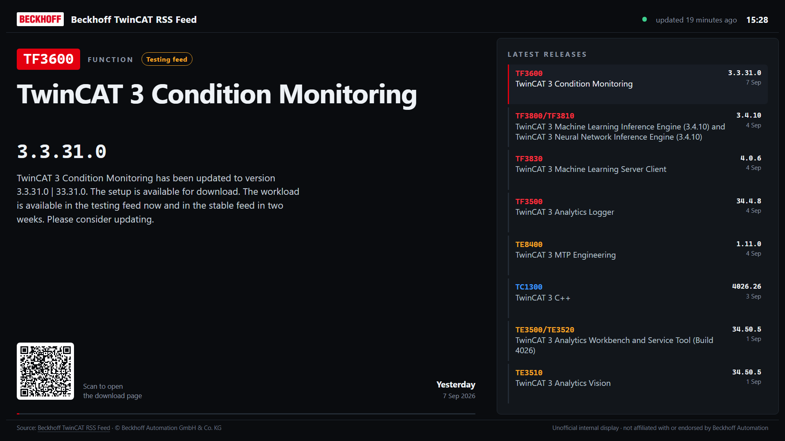

# Twincast

**A TwinCAT release board for an info screen.**

An info-screen board for the public Beckhoff TwinCAT RSS feed. A poller pulls the feed
on an interval and stores it in SQLite; the screen renders from the database and never
touches the network, so it keeps working when the feed does not.

Built for a wall-mounted 1080p landscape display — including a Raspberry Pi running
[Anthias](https://anthias.screenly.io/) pointed at the board's URL.



## What it shows

The TwinCAT feed is a **software release feed**, not a news feed: 361 of its 386 items
are "New version of `<CODE>` `<Product>`". The board leans into that structure —

- the **product code** (`TF3600`) as a large badge, colour-coded by family
  (TF Function, TE Engineering, TC Base, TS Supplement),
- the **version**, parsed out of the description where Beckhoff actually puts it,
- a **release-channel chip** when the text mentions the testing or stable feed,
- a **QR code** to the download page, generated server-side,
- a rail of the latest releases, highlighting whichever the hero is showing.

The hero rotates through the newest `HERO_COUNT` releases every `ROTATE_SECONDS`.

## Run it

### From the published image (recommended)

Multi-arch images (`linux/amd64` + `linux/arm64`) are published to GHCR by
[`.github/workflows/publish.yml`](.github/workflows/publish.yml) only when a valid
version tag such as `v1.0.0` is pushed. `latest` follows stable releases:

```bash
docker pull ghcr.io/scarlsen7757/twincast:latest
```

Use [`docker-compose.example.yml`](docker-compose.example.yml) to run it:

```bash
cp .env.example .env          # edit it — at minimum set USER_AGENT
docker compose -f docker-compose.example.yml up -d
```

Then open <http://localhost:8080/tv>. Pin `IMAGE_TAG` to a version in `.env` for a
screen you don't want changing under you.

Both Compose files store SQLite and the cached logo in **`./data` beside the Compose
file**, mounted at `/data` in the container. No named Docker volume is used.
Create the directory before starting. On Linux, make it writable by the container's
non-root user (UID/GID 1000):

```bash
mkdir -p data
sudo chown 1000:1000 data
docker compose -f docker-compose.example.yml up -d
```

On Docker Desktop for Windows, create `data` with `New-Item -ItemType Directory
-Force data`; Docker Desktop manages bind-mount permissions. If startup reports
permission denied on `/data`, check directory ownership and Docker Desktop file
sharing. Container recreation preserves the files. For a consistent backup, stop
the board, copy the entire `data` directory, then start it again. `data/` is excluded
from Git and the image build context.

### Building it yourself

```bash
docker compose up -d          # docker-compose.yml builds from source
```

For a Raspberry Pi from an x86 machine:

```bash
docker buildx build --platform linux/arm64 -t twincast:arm64 --load .
```

Nothing is compiled at install time (SQLite comes from Node's built-in `node:sqlite`),
so the ARM build needs no toolchain. The TypeScript build stage is pinned to
`$BUILDPLATFORM`, so `tsc` runs natively rather than under QEMU — an arm64 image
takes about the same time as an amd64 one.

### Remote access via Cloudflare tunnel

`docker-compose.example.yml` includes a `cloudflared` service behind an opt-in
profile, so it only runs when you ask for it:

```bash
docker compose -f docker-compose.example.yml --profile tunnel up -d
```

Set `CLOUDFLARE_TUNNEL_TOKEN` in `.env`, and in the Cloudflare dashboard route the
tunnel's public hostname to **Service: HTTP, URL: `board:8080`**.

> **A tunnel puts this board on the public internet.** The board redisplays
> Beckhoff's copyrighted feed content and Beckhoff grants no reuse licence — this
> project's position is that it is an _internal_ display, which a public hostname
> undoes. Put **Cloudflare Access** in front of the hostname (Zero Trust → Access →
> Applications → self-hosted → your hostname → a policy limiting it to your own
> people) before using it. Without an Access policy the board is readable by anyone
> who finds the hostname. See [THIRD-PARTY-LICENSES.md](THIRD-PARTY-LICENSES.md).

### Locally

Use Node 26.8.1 or newer (Node 26 is used in CI and Docker).

```bash
npm install
npm run build        # TypeScript -> dist/
npm start            # http://localhost:8080/tv
npm run poll         # one-shot poll, prints what happened
```

`npm start` runs the compiled output, so `npm run build` has to come first. For an
edit loop, run the compiler and the server in two terminals — no watcher
dependency, both are built in:

```bash
npm run watch        # tsc --watch, recompiles on save
npm run dev          # node --watch dist/src/server.js, restarts on rebuild
```

## Development

The server is TypeScript, compiled by `tsc` to `dist/`. The board runtime in
`public/board.js` is deliberately **not** compiled: it is a plain ES5 IIFE served
verbatim, so the browser side stays build-free.

| Command                | What it does                                                       |
| ---------------------- | ------------------------------------------------------------------ |
| `npm run watch`        | `tsc --watch` — recompile `src/` on save                           |
| `npm run dev`          | Run the compiled server, restarting when `dist/` changes           |
| `npm run build`        | Compile `src/` to `dist/` (production output, no test code)        |
| `npm run typecheck`    | `tsc --noEmit` — types only, no output                             |
| `npm test`             | Clean, compile, then run the compiled suites from `dist/test/`     |
| `npm run lint`         | ESLint over `src/`, `test/`, `public/board.js` and this config     |
| `npm run format`       | Prettier over the repo — **rewrites files**                        |
| `npm run format:check` | Prettier in read-only mode; this is what the gate runs             |
| `npm run check`        | `typecheck` + `lint` + `format:check` + `test` — the pre-push gate |

`npm test` compiles before it runs, so a type error fails it too. The standalone
`typecheck` is kept in the gate because it is the fastest way to see a type error,
before ESLint has to build a program of its own.

Two scripts exist that you should not normally need: `clean` removes `dist/`, and
`lint:fix` applies ESLint's autofixes.

### Making a release

Commit directly to main if that suits your workflow. Ordinary pushes, pull requests,
and manual dispatches do not run the release workflow. Run `npm run check` locally,
then push a version tag when ready:

```bash
npm run check
git push origin main
git tag v1.0.0
git push origin v1.0.0
```

The tag runs code checks, `npm audit --audit-level=high`, and container smoke tests
and vulnerability scans for amd64 and arm64. Publication requires every gate to
pass. Actions use pinned commit IDs and publishing alone gets package-write access.
The Node base image digest is fixed for the duration of each release run.

`v1.2.3` publishes `1.2.3`, `1.2`, `1`, `latest`, and `sha-<full commit SHA>` under
`ghcr.io/scarlsen7757/twincast`. `v1.2.3-rc.1` publishes only `1.2.3-rc.1` and the
commit tag. SemVer build metadata uses `_` instead of `+` in Docker tags, for example
`v1.2.3+build.1` becomes `1.2.3_build.1`. Invalid versions fail before publication.
Push stable tags in release order: each stable release updates its aliases and
`latest`. There is no automatic `edge` image.

To exercise the same container smoke test locally:

```bash
docker buildx build --platform linux/amd64 -t twincast:smoke --load .
node scripts/container-smoke.mjs twincast:smoke linux/amd64
```

The smoke test uses synthetic releases and a disposable bind-mounted directory;
it does not read or change your deployment's `data` directory. Before the first
stable release, trial a local image on the actual display for 24 hours, including
network interruption, restart, and QR scanning.

For repeatable visual checks, run `node scripts/visual-check.mjs` after compiling.
Open `http://127.0.0.1:8097/tv?scene=default`; the other scenes are `empty`, `single`,
`long`, `missing`, and `stale`. With Playwright installed separately, run
`node scripts/browser-check.mjs` to check all six at 1920×1080 and save screenshots
under `data/browser-check`. `PLAYWRIGHT_MODULE` may point to an external Playwright
module, so browser tooling need not become an application dependency.

**TypeScript is pinned to 6.x on purpose.** 7.x is the new native compiler, but no
release of `typescript-eslint` accepts it yet — its peer range is
`typescript >=4.8.4 <6.1.0`. Check `npm view typescript-eslint peerDependencies`
before bumping; when that bound moves, raise both together.

## Configuration

All via environment variables.

| Variable            | Default                   | Purpose                                     |
| ------------------- | ------------------------- | ------------------------------------------- |
| `PORT`              | `8080`                    | HTTP port                                   |
| `FEED_URL`          | Beckhoff TwinCAT RSS      | Any Beckhoff RSS feed                       |
| `POLL_INTERVAL_MIN` | `30`                      | Minutes between polls                       |
| `POLL_ON_START`     | `true`                    | Poll immediately at boot                    |
| `DB_PATH`           | `/data/board.db` (Docker) | SQLite location                             |
| `HERO_COUNT`        | `6`                       | Releases in the rotation                    |
| `RAIL_COUNT`        | `8`                       | Rows in the side rail                       |
| `ROTATE_SECONDS`    | `25`                      | Seconds per hero item                       |
| `STALE_AFTER_MIN`   | `120`                     | Age at which the status dot turns amber     |
| `TZ`                | `Europe/Copenhagen`       | Header clock                                |
| `USER_AGENT`        | self-identifying string   | **Must not look like `curl/*`** — see below |

Numeric configuration is validated at startup. Unset values use the defaults above;
invalid explicit values fail with the variable name. Supported ranges are PORT
1–65535, HERO_COUNT and RAIL_COUNT 1–8, ROTATE_SECONDS 5–300 (integers),
POLL_INTERVAL_MIN 0.1–1440, and STALE_AFTER_MIN 1–10080. The last two may be
fractional. Polling waits the configured interval after each completed attempt.

Feed ingestion is bounded to 5 MiB of decompressed XML, 5,000 items and 64 KiB per
text field. Download links accept HTTP/HTTPS only and at most 2,048 UTF-8 bytes.
Logos accept PNG/JPEG signatures, at most 1 MiB, fetched over HTTPS from the feed's
configured origin without redirects. A rejected logo or unavailable QR leaves the
release text usable. Stored history is retained across polls.

The board compares a content revision to detect changed releases, including new
versions of the same product, and reloads at the next rotation wrap. Freshness ages
locally; “Feed stale” and “Connection unavailable” distinguish old feed data from
loss of connection to the board server.

## Endpoints

| Path                | Purpose                                                                                                  |
| ------------------- | -------------------------------------------------------------------------------------------------------- |
| `/tv`               | **The info screen.** Server-rendered, with content and QR codes already in the HTML. Point Anthias here. |
| `/`                 | Same board today; reserved for the future interactive view                                               |
| `/api/news?limit=N` | JSON data contract; always succeeds, carries `stale` / `lastSuccess`                                     |
| `/healthz`          | `200` when releases are stored, `503` otherwise; used by the Docker healthcheck                          |
| `/logo`             | The feed's own logo, cached locally so it renders offline                                                |

`/api/news` returns 25 items by default and at most 100, independently of display
counts. Missing or invalid limits use 25; positive integer limits clamp to 100.
Responses include `contentRevision` (SHA-256 of displayed content), freshness
metadata and plain release items without QR markup.

## Using it with Anthias

Add the board as a **web page asset** pointing at `http://<host>:8080/tv`.

Use `/tv`, not `/`: the root path is reserved for the interactive desktop view, so a
screen configured against `/tv` keeps showing the board once that lands.

Set the asset duration to at least one full rotation — `HERO_COUNT × ROTATE_SECONDS`,
so **150 seconds** at the defaults (6 items × 25 s) — otherwise Anthias cycles away
before the board has shown every release.

**Use a 5-minute duration** — that is what the defaults are tuned for. 300 s is
exactly two 150 s cycles, so every release gets identical screen time, and each one
is shown twice per showing, which matters on a screen people glance at rather than
watch. A 3-minute slot also works but leaves a 30 s tail, during which the first item
or two appear a second time while the rest do not.

The client-side timers (feed re-check, burn-in nudge) are sized to fit inside one
showing. If you set a much shorter Anthias duration, check they still fire:
a timer longer than the asset duration never runs, because the page is destroyed
first.

Anthias reloads the page each time the asset comes up, which is why the board is
server-rendered: the newest release is in the HTML on first paint, with no loading
flash, and the rotation always restarts from the most recent release.

## Notes from the feed

Things worth knowing, all measured against the live feed:

- **No CORS header**, so a purely static page cannot fetch this feed in a browser.
  That is why a server side exists at all.
- **The WAF rejects `curl/*` with 403** but accepts a self-identifying agent. This
  project sends `Twincast/1.0 (+contact)` rather than impersonating a
  browser, so Beckhoff can recognise, contact or block it.
- **Conditional requests are ignored.** `If-None-Match` and `If-Modified-Since` both
  return a full `200`; the feed is served `Cache-Control: no-cache`. The headers are
  still sent in case that changes. Meanwhile **gzip is supported**, so a poll costs
  about 19 kB rather than 266 kB, and the poller hashes the body to skip re-parsing
  and re-writing 386 rows when nothing changed — which matters on a Pi's SD card.
- **The feed advertises `<ttl>60</ttl>`.** The default here is 30 minutes; set
  `POLL_INTERVAL_MIN=60` to follow the publisher's hint exactly.
- **Item links are not unique** — 99 distinct URLs across 387 items, mostly generic
  download-finder pages. The QR is labelled "scan to open the download page" rather
  than pretending each item has its own article.
- **No images anywhere** in the feed, hence the typographic design.
- **History accumulates.** Rows are keyed on GUID and never deleted, so the database
  keeps releases after they age out of the feed's rolling window.

## Attribution

Feed content is © Beckhoff Automation GmbH & Co. KG. The board displays that notice
verbatim, reading it from the feed itself, links every item back to Beckhoff, and
labels itself an unofficial display. It is intended for **internal** use — see
[THIRD-PARTY-LICENSES.md](THIRD-PARTY-LICENSES.md) before exposing it publicly.

Beckhoff® and TwinCAT® are registered trademarks of Beckhoff Automation GmbH & Co. KG.
This project is not affiliated with Beckhoff Automation.

## Licence

Twincast is [MIT licensed](LICENSE). Every runtime dependency is MIT too, so
there is nothing viral in the tree.

The licence covers **this source code only**. It grants no rights to the feed
content the board displays — that stays Beckhoff's, and no feed content is stored
in this repository; it is fetched at runtime by whoever runs the software. The
screenshot in `docs/` necessarily shows Beckhoff product text and their logo, and
is included to document the software rather than being MIT-licensed material.
